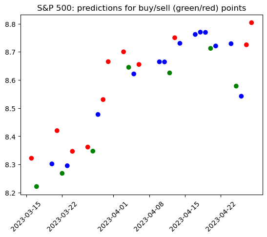
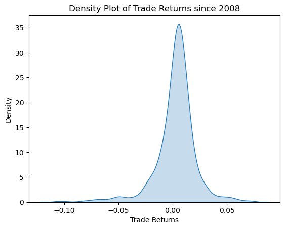
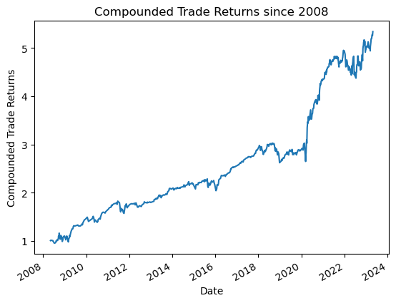

# Independent Equity Research

  
  

  

  
  

  
  

  
  

### Description

The aim of this project is to utilize signal discovery and stock market price prediction techniques to create a reliable executable trading strategy. To ensure consistency, the strategy is be backtested on data not yet seen by the model. The target variable is local minima and maxima of the S&P 500 price, with features including moving averages, economic indicators, adjusted close price, etc.

### Access report
Analysis is in progress on Equity_Research.ipynb with established prediction and backtesting piepeline. Currently facing problems of overfitting and underfitting in machine learning, where models have either learned too much from the training data and are unable to generalize to new data (overfitting), or have not learned enough and are too simplistic to accurately predict (underfitting). Current focus is on improving the model to predict consistently across all classes (minima/buy, maxima/sell, neither/hold) with high accuracy and generalizability.  Later on, trade strategy will be optimized through tools like the kelly criterion.
